# ✂️ Terminal Barber

<p align="center">
  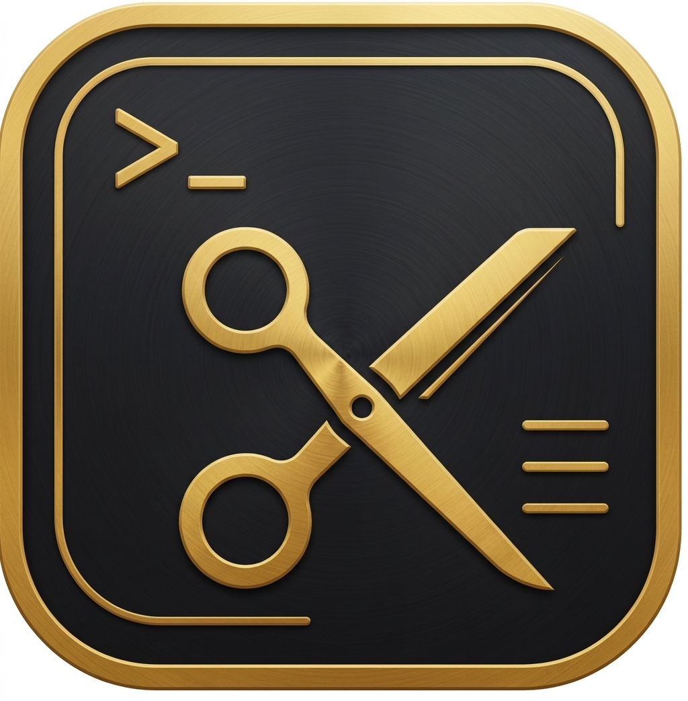
</p>

<p align="center">
  <strong>Agendamento de barbearia fácil, rápido e profissional.</strong><br/>
  <em>"Código no terminal, estilo na vida."</em>
</p>

<p align="center">
  
  
  
  
</p>

---

## 📱 Sobre o Projeto

O **Terminal Barber** é um aplicativo mobile desenvolvido em **Flutter** como projeto final do curso de GTI (Gestão de Tecnologia da Informação). O app foi criado para a barbearia do parceiro de dupla, oferecendo uma solução completa de agendamento online com funcionalidades tanto para clientes quanto para o proprietário.

---

## ✅ Funcionalidades

### 👤 Para o Cliente
- Cadastro com e-mail/senha ou conta Google
- Verificação de e-mail após o cadastro
- Login com e-mail/senha ou Google
- Recuperação de senha via e-mail
- Visualização dos horários disponíveis em tempo real
- Agendamento de serviços com escolha de data e horário
- Horários passados bloqueados automaticamente
- Horários ocupados por outros clientes bloqueados por duração do serviço
- Cancelamento de agendamento
- Notificação de lembrete **1 hora antes** do atendimento
- **Cartão fidelidade** — a cada 5 atendimentos, o próximo é grátis
- Edição de perfil (nome e telefone)
- Tema claro e escuro

### 🏠 Para o Proprietário
- Painel completo de agendamentos
- Filtro de agendamentos **por dia** com navegação por setas
- Navegação por qualquer data no calendário
- Filtro por status: pendente, confirmado, atendido, cancelado
- Confirmação e cancelamento de agendamentos
- Marcação de atendimento como **concluído**
- Atualização automática do cartão fidelidade do cliente
- Aba de **Clientes** com lista em ordem alfabética
- Histórico completo de agendamentos por cliente
- Visualização do progresso do cartão fidelidade por cliente
- Tema claro e escuro

---

## 🛠️ Tecnologias Utilizadas

| Tecnologia | Uso |
|---|---|
| Flutter | Framework principal |
| Dart | Linguagem de programação |
| Firebase Auth | Autenticação de usuários |
| Cloud Firestore | Banco de dados em nuvem |
| Firebase Google Sign-In | Login com Google |
| flutter_local_notifications | Notificações locais agendadas |
| shared_preferences | Persistência de sessão |
| flutter_localizations | Calendário em português (pt-BR) |
| timezone | Fuso horário para notificações |

---

## 📋 Requisitos do Projeto Acadêmico

| # | Requisito | Status |
|---|---|---|
| 1 | Tema claro e escuro | ✅ |
| 2 | Design profissional com harmonização de cores | ✅ |
| 3 | CRUD completo com banco de dados permanente | ✅ |
| 4 | Senha de acesso | ✅ |
| 5 | Recuperação e atualização de senha via e-mail | ✅ |
| 6 | Tela com dados ordenados alfabeticamente | ✅ |
| 7 | Design responsivo | ✅ |
| 8 | Capacidade de deploy | ✅ |
| 9 | Mínimo de 4 janelas com funções diferentes | ✅ |
| 10 | Utilidade social/comercial | ✅ |

---

## 🗂️ Estrutura de Telas

```
lib/
├── main.dart                  # Inicialização e roteamento
├── login.dart                 # Tela de login
├── registro.dart              # Tela de cadastro
├── verificacao_email.dart     # Tela de verificação de e-mail
├── home_cliente.dart          # Home do cliente + cartão fidelidade
├── home_owner.dart            # Painel do proprietário
├── novo_agendamento.dart      # Tela de agendamento
├── perfil_cliente.dart        # Tela de perfil do cliente
├── agendamento_model.dart     # Modelo de dados do agendamento
├── user_model.dart            # Modelo de dados do usuário
├── servicos_config.dart       # Configuração de serviços, preços e duração
├── notificacao_service.dart   # Serviço de notificações locais
└── app_bar_custom.dart        # AppBar personalizada com botão de tema
```

---

## 💈 Serviços Disponíveis

| Serviço | Preço | Duração |
|---|---|---|
| Corte completo (cabelo + barba + sobrancelha) | R$ 40,00 | 60 min |
| Corte de cabelo | R$ 25,00 | 40 min |
| Barba | R$ 10,00 | 15 min |
| Pé do cabelo | R$ 8,00 | 10 min |
| Cabelo + barba | R$ 35,00 | 60 min |
| Cabelo + sobrancelha | R$ 30,00 | 45 min |
| Barba + sobrancelha | R$ 17,00 | 20 min |
| Sobrancelha | R$ 5,00 | 5 min |
| Pigmentação | R$ 12,00 | 10 min |
| Relaxamento | R$ 60,00 | 90 min |
| Platinado | R$ 120,00 | 2h30 |
| Luzes | R$ 80,00 | 2h |
| Hidratação capilar | R$ 35,00 | 40 min |
| Selagem | R$ 90,00 | 2h |

---

## 🚀 Como Executar o Projeto

### Pré-requisitos
- Flutter SDK 3.x instalado
- Android Studio instalado
- Conta no Firebase configurada

### Configuração

**1. Clone o repositório:**
```bash
git clone https://github.com/seu-usuario/terminal_barber.git
cd terminal_barber
```

**2. Instale as dependências:**
```bash
flutter pub get
```

**3. Configure o Firebase:**
- Crie um projeto no [Firebase Console](https://console.firebase.google.com)
- Ative Authentication (e-mail/senha e Google)
- Ative o Cloud Firestore
- Baixe o `google-services.json` e coloque em `android/app/`
- Execute `flutterfire configure`

**4. Execute o app:**
```bash
flutter run
```

---

## 🗄️ Estrutura do Firestore

```
usuarios/
  {uid}/
    nome: string
    email: string
    telefone: string
    role: "client" | "owner"
    totalAtendidos: number
    criadoEm: timestamp

agendamentos/
  {id}/
    clienteUid: string
    clienteNome: string
    clienteTelefone: string
    servico: string
    duracaoMinutos: number
    preco: number
    dataHora: timestamp
    status: "pendente" | "confirmado" | "atendido" | "cancelado"
    gratis: boolean
    criadoEm: timestamp
```

---

## 🎨 Identidade Visual

- **Cor primária:** Dourado `#D4A017`
- **Fundo escuro:** `#1A1A1A`
- **Fundo claro:** `#F5F5F5`
- **Card escuro:** `#2C2C2C`

---

## 👨‍💻 Desenvolvedores
Caio Cardoso e Samuel Antonio
Desenvolvido como projeto final do curso de **GTI 2026**.

---

## 📄 Licença

Este projeto foi desenvolvido para fins acadêmicos.

## 📸 Screenshots

### 🔐 Autenticação
<p align="center">
  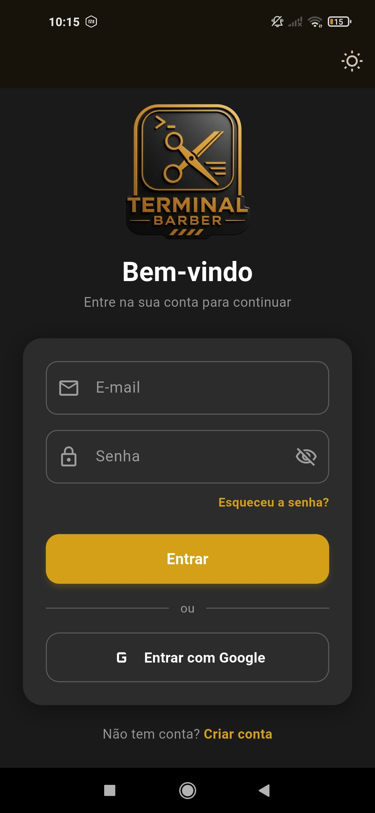
  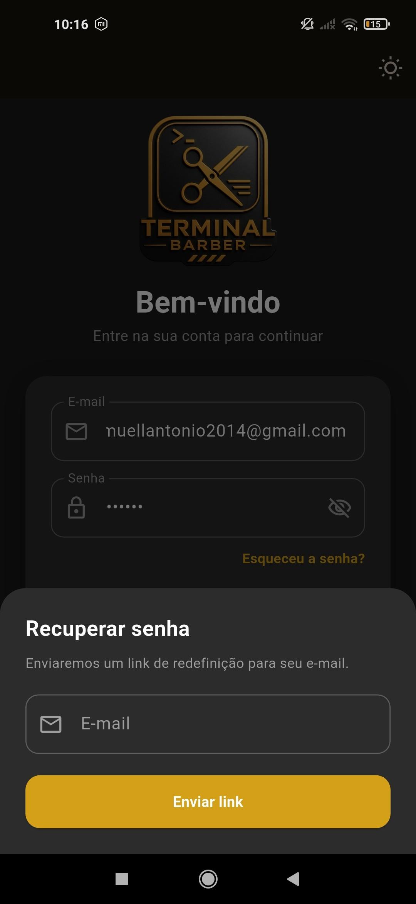
  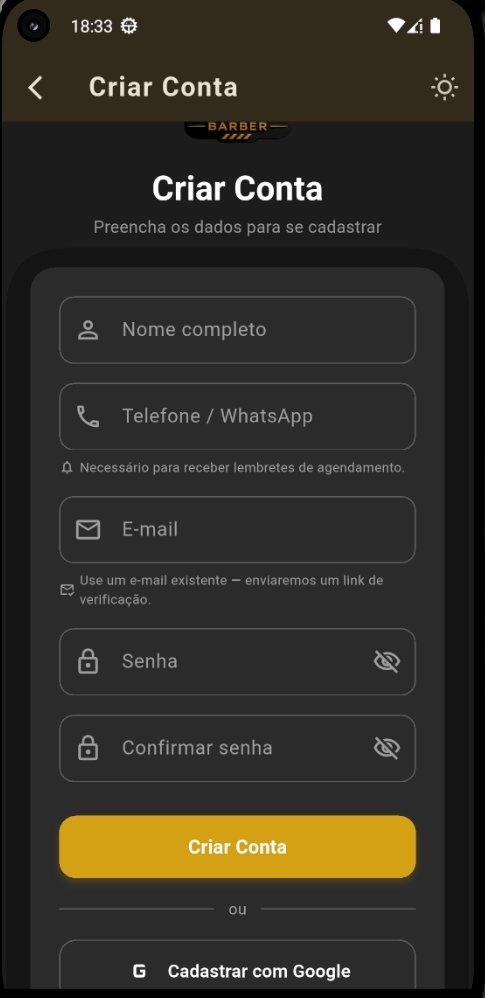
</p>

### 👤 Área do Cliente
<p align="center">
  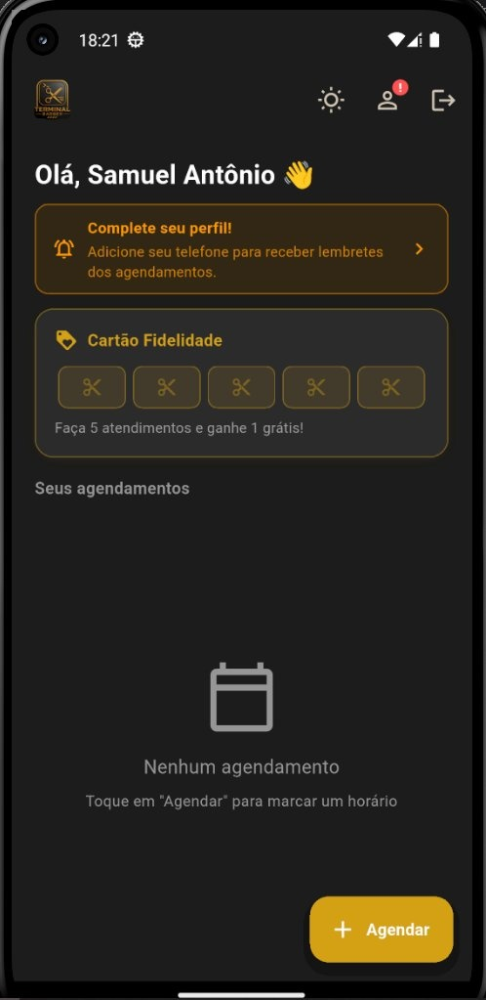
  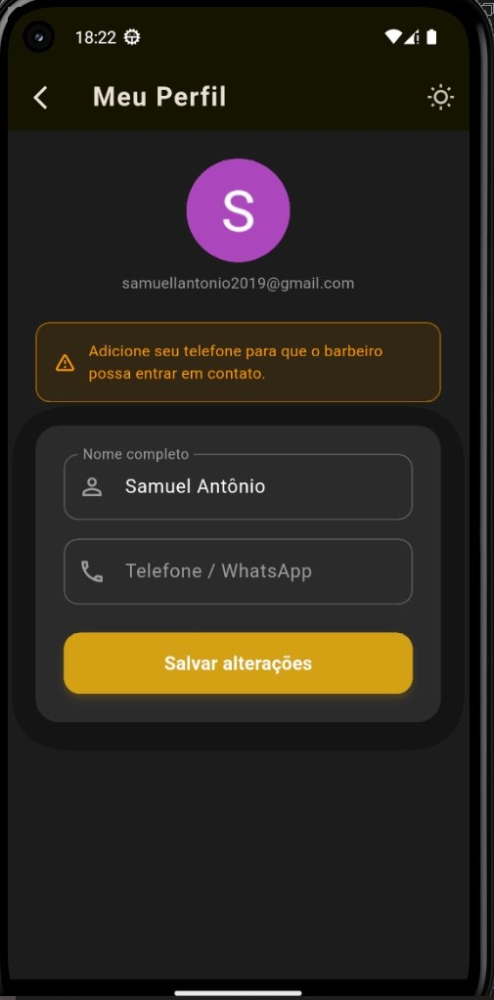
  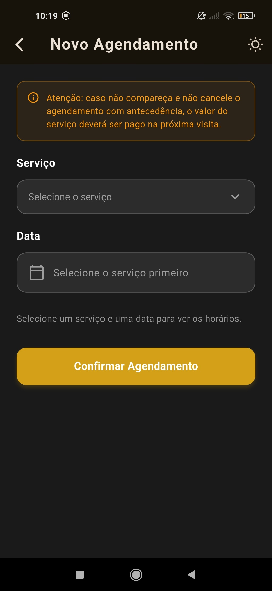
</p>
<p align="center">
  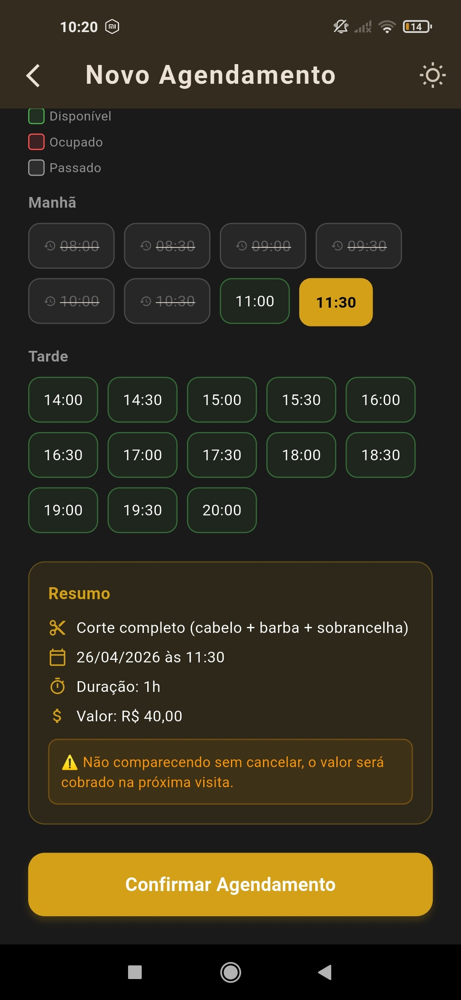
  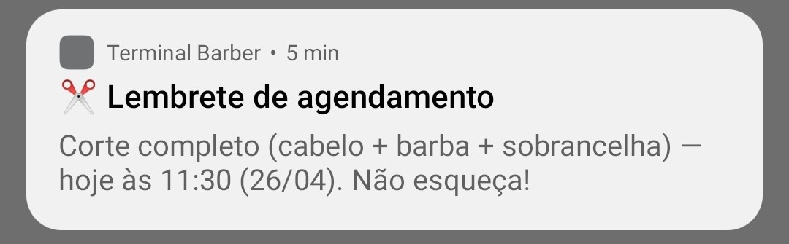
</p>

### 🏠 Painel do Proprietário
<p align="center">
  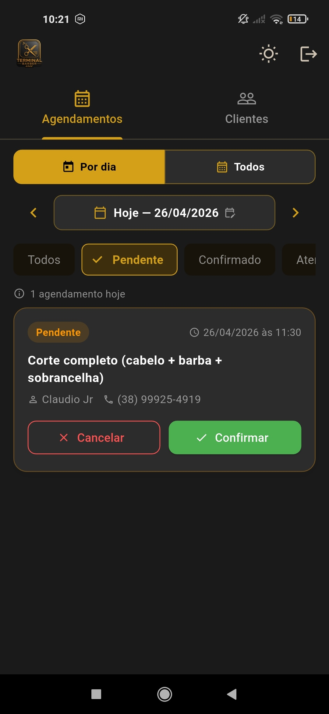
  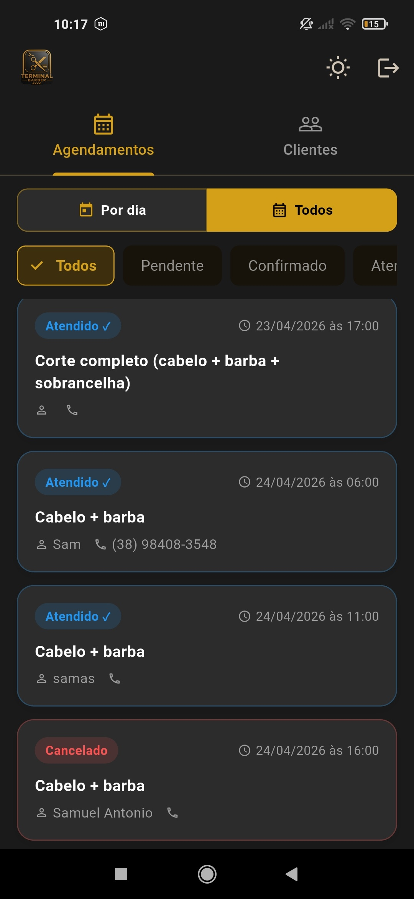
  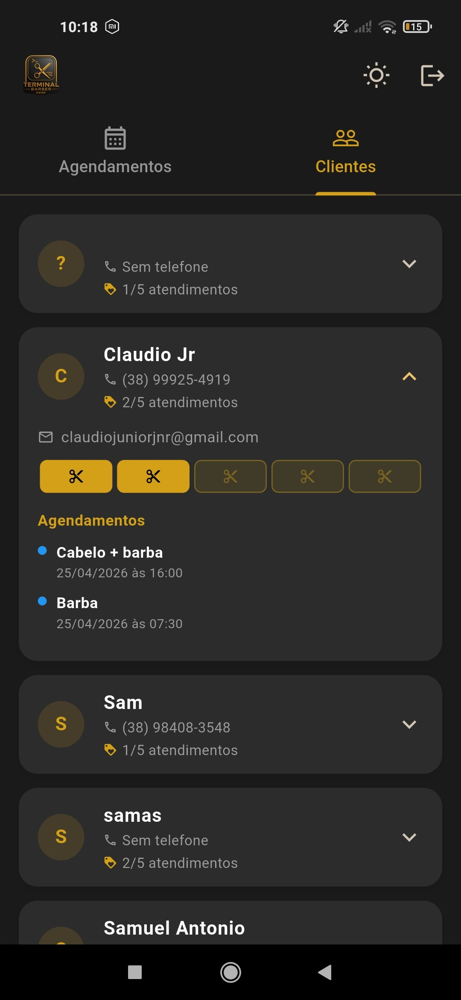
</p>